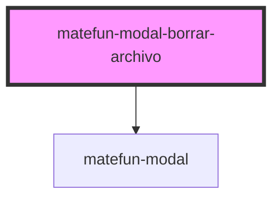

# matefun-modal-borrar-archivo

<!-- Auto Generated Below -->

## Properties

| Property          | Attribute          | Description                                                                | Type      | Default     |
| ----------------- | ------------------ | -------------------------------------------------------------------------- | --------- | ----------- |
| `bodyDescription` | `body-description` | Texto del descriptivo del mensaje del body.                                | `string`  | `undefined` |
| `cancelLabel`     | `cancel-label`     | Texto del label asociado al button de cancelar la eliminación del archivo. | `string`  | `undefined` |
| `confirmLabel`    | `confirm-label`    | Texto del label asociado al button de confirmar la creación del archivo.   | `string`  | `undefined` |
| `header`          | `header`           | El título del modal.                                                       | `string`  | `undefined` |
| `opened`          | `opened`           | `true` si el modal está abierto.                                           | `boolean` | `false`     |

## Events

| Event          | Description                                                                     | Type               |
| -------------- | ------------------------------------------------------------------------------- | ------------------ |
| `cancelAction` | Se dispara cuando se cancela la eliminación del archivo.                        | `CustomEvent<any>` |
| `removeFile`   | Se dispara cuando se confirma la eliminación del archivo del directorio actual. | `CustomEvent<any>` |

## Dependencies

### Depends on

- [matefun-modal](../modal)

### Graph

----------------------------------------------

*Built with [StencilJS](https://stenciljs.com/)*
