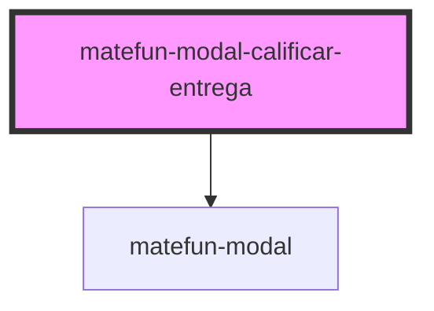

# matefun-modal-calificar-entrega

<!-- Auto Generated Below -->

## Properties

| Property          | Attribute       | Description                                                                            | Type       | Default     |
| ----------------- | --------------- | -------------------------------------------------------------------------------------- | ---------- | ----------- |
| `cancelLabel`     | `cancel-label`  | Texto del label asociado al button de cancelar el envío del archivo.                   | `string`   | `undefined` |
| `confirmLabel`    | `confirm-label` | Texto del label asociado al button de confirmar el envío del archivo.                  | `string`   | `undefined` |
| `detail`          | `detail`        | Descripción asociada a la entrega, en caso de que ya haya sido calificada previamente. | `string`   | `undefined` |
| `detailLabel`     | `detail-label`  | Texto descriptivo del mensaje del body que va en el label del detalle.                 | `string`   | `undefined` |
| `header`          | `header`        | El título del modal.                                                                   | `string`   | `undefined` |
| `opened`          | `opened`        | `true` si el modal está abierto.                                                       | `boolean`  | `false`     |
| `posibleStatuses` | --              | Arreglos de posibles estados de la entrega                                             | `Status[]` | `undefined` |
| `score`           | `score`         | Puntaje asociado a la entrega, en caso de que ya haya sido calificada previamente.     | `string`   | `undefined` |
| `scoreLabel`      | `score-label`   | Texto descriptivo del mensaje del body que va en el label del puntaje.                 | `string`   | `undefined` |
| `status`          | `status`        | Estado asociado a la entrega, en caso de que ya haya sido calificada previamente.      | `string`   | `undefined` |
| `statusLabel`     | `status-label`  | Texto descriptivo del mensaje del body que va en el label del estado de la entrega.    | `string`   | `undefined` |

## Events

| Event                | Description                                                | Type               |
| -------------------- | ---------------------------------------------------------- | ------------------ |
| `cancelAction`       | Se dispara cuando se cancela la calificación del archivo.  | `CustomEvent<any>` |
| `confirmFileQualify` | Se dispara cuando se confirma la calificación del archivo. | `CustomEvent<any>` |

## Dependencies

### Depends on

- [matefun-modal](../modal)

### Graph

----------------------------------------------

*Built with [StencilJS](https://stenciljs.com/)*
