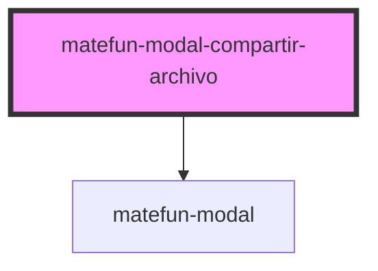

# matefun-modal-compartir-archivo

<!-- Auto Generated Below -->

## Properties

| Property       | Attribute       | Description                                                              | Type      | Default     |
| -------------- | --------------- | ------------------------------------------------------------------------ | --------- | ----------- |
| `confirmLabel` | `confirm-label` | Texto del label asociado al button de confirmar la creación del archivo. | `string`  | `undefined` |
| `groups`       | --              | Grupos a los cuales se les puede compartir el archivo selecciondo.       | `Grupo[]` | `undefined` |
| `header`       | `header`        | El título del modal.                                                     | `string`  | `undefined` |
| `opened`       | `opened`        | `true` si el modal está abierto.                                         | `boolean` | `false`     |

## Events

| Event              | Description                                                                                   | Type               |
| ------------------ | --------------------------------------------------------------------------------------------- | ------------------ |
| `confirmFileShare` | Se dispara cuando se confirma la operación de compartir el archivo con el grupo seleccionado. | `CustomEvent<any>` |

## Dependencies

### Depends on

- [matefun-modal](../modal)

### Graph

----------------------------------------------

*Built with [StencilJS](https://stenciljs.com/)*
