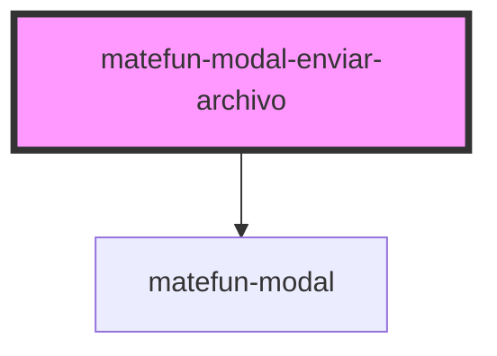

# matefun-modal-enviar-archivo

<!-- Auto Generated Below -->

## Properties

| Property          | Attribute          | Description                                                           | Type      | Default     |
| ----------------- | ------------------ | --------------------------------------------------------------------- | --------- | ----------- |
| `bodyDescription` | `body-description` | Texto descriptivo del mensaje del body.                               | `string`  | `undefined` |
| `cancelLabel`     | `cancel-label`     | Texto del label asociado al button de cancelar el envío del archivo.  | `string`  | `undefined` |
| `confirmLabel`    | `confirm-label`    | Texto del label asociado al button de confirmar el envío del archivo. | `string`  | `undefined` |
| `header`          | `header`           | El título del modal.                                                  | `string`  | `undefined` |
| `opened`          | `opened`           | `true` si el modal está abierto.                                      | `boolean` | `false`     |

## Events

| Event             | Description                                         | Type               |
| ----------------- | --------------------------------------------------- | ------------------ |
| `cancelAction`    | Se dispara cuando se cancela el envío del archivo.  | `CustomEvent<any>` |
| `confirmFileSend` | Se dispara cuando se confirma el envío del archivo. | `CustomEvent<any>` |

## Dependencies

### Depends on

- [matefun-modal](../modal)

### Graph

----------------------------------------------

*Built with [StencilJS](https://stenciljs.com/)*
