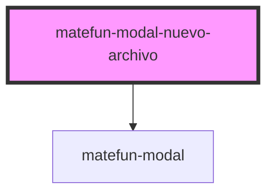

# matefun-nuevo-archivo

<!-- Auto Generated Below -->

## Properties

| Property               | Attribute                | Description                                                                       | Type                    | Default     |
| ---------------------- | ------------------------ | --------------------------------------------------------------------------------- | ----------------------- | ----------- |
| `confirmLabel`         | `confirm-label`          | Texto del label asociado al button de confirmar la creación del archivo.          | `string`                | `undefined` |
| `fileDescriptionLabel` | `file-description-label` | Texto del label asociado al input para ingresar la descripción del nuevo archivo. | `string`                | `undefined` |
| `fileNameLabel`        | `file-name-label`        | Texto del label asociado al input para ingresar el nombre del nuevo archivo.      | `string`                | `undefined` |
| `header`               | `header`                 | El título del modal.                                                              | `string`                | `undefined` |
| `opened`               | `opened`                 | `true` si el modal está abierto.                                                  | `boolean`               | `false`     |
| `typeOfFile`           | `type-of-file`           | Determina si el archivo a agregar es un directorio o un archivo.                  | `"directory" \| "file"` | `"file"`    |

## Events

| Event                 | Description                                                                    | Type               |
| --------------------- | ------------------------------------------------------------------------------ | ------------------ |
| `confirmFileCreation` | Se dispara cuando se confirma la creación del archivo en el directorio actual. | `CustomEvent<any>` |

## Dependencies

### Depends on

- [matefun-modal](../modal)

### Graph

----------------------------------------------

*Built with [StencilJS](https://stenciljs.com/)*
