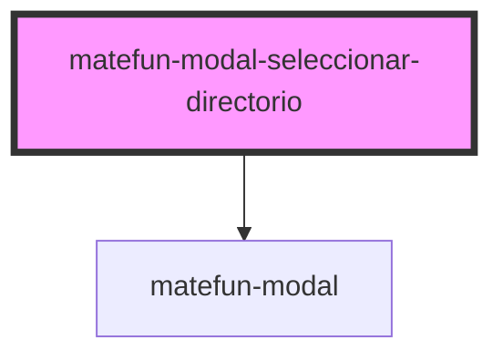

# matefun-modal-seleccionar-directorio

<!-- Auto Generated Below -->

## Properties

| Property            | Attribute             | Description                                                                  | Type      | Default     |
| ------------------- | --------------------- | ---------------------------------------------------------------------------- | --------- | ----------- |
| `confirmLabel`      | `confirm-label`       | Texto del label asociado al button de confirmar la creación del archivo.     | `string`  | `undefined` |
| `fileContent`       | `file-content`        |                                                                              | `string`  | `undefined` |
| `fileNameLabel`     | `file-name-label`     | Texto del label asociado al input para ingresar el nombre del nuevo archivo. | `string`  | `undefined` |
| `header`            | `header`              | El título del modal.                                                         | `string`  | `undefined` |
| `import`            | `import`              |                                                                              | `boolean` | `false`     |
| `importLabel`       | `import-label`        |                                                                              | `string`  | `undefined` |
| `navigateBackLabel` | `navigate-back-label` | Texto asociado al botón de navegar hacia atrás.                              | `string`  | `undefined` |
| `opened`            | `opened`              | `true` si el modal está abierto.                                             | `boolean` | `false`     |
| `rootDirectory`     | --                    | Directorio root sobre el cual se están visualizando sus archivos.            | `Archivo` | `null`      |

## Events

| Event                 | Description                                                                    | Type               |
| --------------------- | ------------------------------------------------------------------------------ | ------------------ |
| `confirmFileCreation` | Se dispara cuando se confirma la creación del archivo en el directorio actual. | `CustomEvent<any>` |
| `navBack`             | Se dispara cuando se quiere navegar hacia el directorio padre.                 | `CustomEvent<any>` |
| `navTo`               | Se dispara cuando se quiere navegar hacia un subdirectorio.                    | `CustomEvent<any>` |

## Dependencies

### Depends on

- [matefun-modal](../modal)

### Graph

----------------------------------------------

*Built with [StencilJS](https://stenciljs.com/)*
