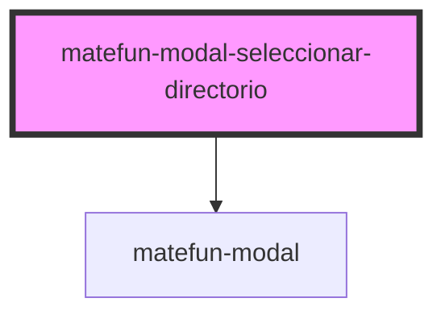

# matefun-modal-seleccionar-directorio

<!-- Auto Generated Below -->

## Properties

| Property            | Attribute              | Description                                                                  | Type      | Default     |
| ------------------- | ---------------------- | ---------------------------------------------------------------------------- | --------- | ----------- |
| `canNavigateToBack` | `can-navigate-to-back` | `true` si puede navegar hacia atrás en la lista de directorios.              | `boolean` | `undefined` |
| `confirmLabel`      | `confirm-label`        | Texto del label asociado al button de confirmar la creación del archivo.     | `string`  | `undefined` |
| `fileContent`       | `file-content`         |                                                                              | `string`  | `undefined` |
| `fileNameLabel`     | `file-name-label`      | Texto del label asociado al input para ingresar el nombre del nuevo archivo. | `string`  | `undefined` |
| `header`            | `header`               | El título del modal.                                                         | `string`  | `undefined` |
| `import`            | `import`               |                                                                              | `boolean` | `false`     |
| `importLabel`       | `import-label`         |                                                                              | `string`  | `undefined` |
| `navigateBackLabel` | `navigate-back-label`  |                                                                              | `string`  | `undefined` |
| `opened`            | `opened`               | Este atributo permite especificar si el modal está abierto o cerrado.        | `boolean` | `false`     |
| `rootDirectory`     | --                     | Directorio root                                                              | `Archivo` | `null`      |

## Events

| Event                 | Description                                                                    | Type               |
| --------------------- | ------------------------------------------------------------------------------ | ------------------ |
| `confirmFileCreation` | Se dispara cuando se confirma la creación del archivo en el directorio actual. | `CustomEvent<any>` |

## Dependencies

### Depends on

- [matefun-modal](../modal)

### Graph

----------------------------------------------

*Built with [StencilJS](https://stenciljs.com/)*
