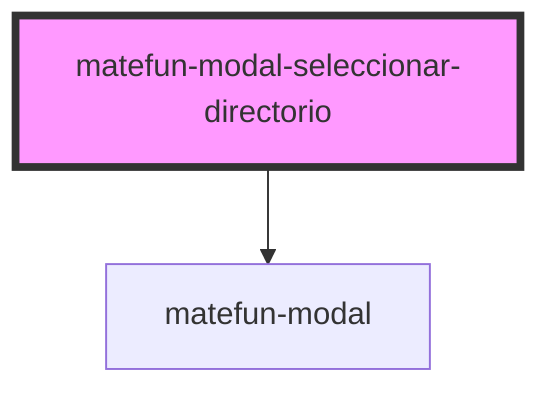

# matefun-modal-seleccionar-directorio

<!-- Auto Generated Below -->

## Properties

| Property            | Attribute             | Description                                                                                                                                                                                                                                                                                                                   | Type              | Default     |
| ------------------- | --------------------- | ----------------------------------------------------------------------------------------------------------------------------------------------------------------------------------------------------------------------------------------------------------------------------------------------------------------------------- | ----------------- | ----------- |
| `confirmLabel`      | `confirm-label`       | Texto del label asociado al button de confirmar la creación del archivo.                                                                                                                                                                                                                                                      | `string`          | `undefined` |
| `currentDirectory`  | --                    | Directorio actual sobre el cual se están visualizando sus archivos.                                                                                                                                                                                                                                                           | `Archivo`         | `null`      |
| `fileContent`       | `file-content`        |                                                                                                                                                                                                                                                                                                                               | `string`          | `undefined` |
| `fileIdToMove`      | `file-id-to-move`     | Id del archivo a mover. Esta propiedad solo aplica cuando `typeOfModal` == `"move"`, y permite evitar mover una carpeta para algunos de sus subdirectorios, evitando así un ciclo en el árbol de directorios.                                                                                                                 | `number`          | `-1`        |
| `fileNameLabel`     | `file-name-label`     | Texto del label asociado al input para ingresar el nombre del nuevo archivo.                                                                                                                                                                                                                                                  | `string`          | `undefined` |
| `header`            | `header`              | El título del modal.                                                                                                                                                                                                                                                                                                          | `string`          | `undefined` |
| `import`            | `import`              |                                                                                                                                                                                                                                                                                                                               | `boolean`         | `false`     |
| `importLabel`       | `import-label`        |                                                                                                                                                                                                                                                                                                                               | `string`          | `undefined` |
| `initialPath`       | `initial-path`        | Path (ruta) inicial en donde se encuentra el directorio indicado por la propiedad `currentDirectory`.                                                                                                                                                                                                                         | `string`          | `"/"`       |
| `navigateBackLabel` | `navigate-back-label` | Texto asociado al botón de navegar hacia atrás.                                                                                                                                                                                                                                                                               | `string`          | `undefined` |
| `opened`            | `opened`              | `true` si el modal está abierto.                                                                                                                                                                                                                                                                                              | `boolean`         | `false`     |
| `typeOfModal`       | `type-of-modal`       | Determina la funcionalidad final del modal.  * `"add"`: Modal para agregar un archivo. Permite recorrer el árbol de    directorios y muestra un dialogo adicional para especificar el nombre    del archivo a agregar.   * `"move"`: Modal para mover un archivo/carpeta. Solo se permte recorrer    el árbol de directorios. | `"add" \| "move"` | `"add"`     |

## Events

| Event                 | Description                                                                                        | Type               |
| --------------------- | -------------------------------------------------------------------------------------------------- | ------------------ |
| `confirmFileCreation` | Se dispara cuando se confirma la operación de crear o mover el archivo sobre el directorio actual. | `CustomEvent<any>` |
| `navBack`             | Se dispara cuando se quiere navegar hacia el directorio padre.                                     | `CustomEvent<any>` |
| `navTo`               | Se dispara cuando se quiere navegar hacia un subdirectorio.                                        | `CustomEvent<any>` |

## Dependencies

### Depends on

- [matefun-modal](../modal)

### Graph

----------------------------------------------

*Built with [StencilJS](https://stenciljs.com/)*
