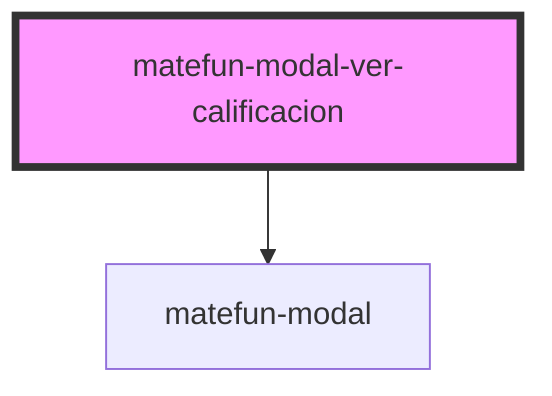

# matefun-modal-ver-calificacion

<!-- Auto Generated Below -->

## Properties

| Property       | Attribute       | Description                                                            | Type      | Default     |
| -------------- | --------------- | ---------------------------------------------------------------------- | --------- | ----------- |
| `confirmLabel` | `confirm-label` | Texto del label asociado al button de confirmar cerrar el modal.       | `string`  | `undefined` |
| `date`         | `date`          | Texto descriptivo del mensaje del body que va en la fecha.             | `string`  | `undefined` |
| `dateLabel`    | `date-label`    | Texto descriptivo del mensaje del body que va en el label de la fecha. | `string`  | `undefined` |
| `detail`       | `detail`        | Texto descriptivo del mensaje del body que va en el detalle.           | `string`  | `undefined` |
| `detailLabel`  | `detail-label`  | Texto descriptivo del mensaje del body que va en el label del detalle. | `string`  | `undefined` |
| `header`       | `header`        | El título del modal.                                                   | `string`  | `undefined` |
| `opened`       | `opened`        | `true` si el modal está abierto.                                       | `boolean` | `false`     |
| `score`        | `score`         | Texto descriptivo del mensaje del body que va en el puntaje.           | `string`  | `undefined` |
| `scoreLabel`   | `score-label`   | Texto descriptivo del mensaje del body que va en el label del puntaje. | `string`  | `undefined` |

## Events

| Event          | Description                                         | Type               |
| -------------- | --------------------------------------------------- | ------------------ |
| `confirmClose` | Se dispara cuando se confirma el cerrado del modal. | `CustomEvent<any>` |

## Dependencies

### Depends on

- [matefun-modal](../modal)

### Graph

----------------------------------------------

*Built with [StencilJS](https://stenciljs.com/)*
