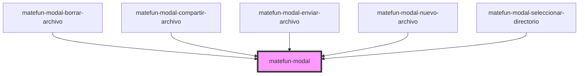

# matefun-modal

<!-- Auto Generated Below -->

## Properties

| Property           | Attribute            | Description                                                                                  | Type      | Default            |
| ------------------ | -------------------- | -------------------------------------------------------------------------------------------- | --------- | ------------------ |
| `closeButtonLabel` | `close-button-label` | This attribute lets you specify the label for the close button. Important for accessibility. | `string`  | `"Cerrar diálogo"` |
| `height`           | `height`             | This attribute lets you specify the height of the control.                                   | `string`  | `null`             |
| `opened`           | `opened`             | Este atributo permite especificar si el modal está abierto o cerrado.                        | `boolean` | `false`            |
| `showBody`         | `show-body`          | This attribute lets you specify if a body is rendered in the middle of the modal dialog.     | `boolean` | `true`             |
| `showFooter`       | `show-footer`        | This attribute lets you specify if a footer is rendered at the bottom of the modal dialog.   | `boolean` | `true`             |
| `showHeader`       | `show-header`        | This attribute lets you specify if a header is rendered on top of the modal dialog.          | `boolean` | `true`             |
| `width`            | `width`              | This attribute lets you specify the width of the control.                                    | `string`  | `null`             |

## Events

| Event   | Description                                  | Type               |
| ------- | -------------------------------------------- | ------------------ |
| `close` | Se dispara cuando se cierra el dialogo modal | `CustomEvent<any>` |
| `open`  | Se dispara cuando se abre el dialogo modal   | `CustomEvent<any>` |

## Shadow Parts

| Part             | Description |
| ---------------- | ----------- |
| `"body"`         |             |
| `"close-button"` |             |
| `"dialog"`       |             |
| `"footer"`       |             |
| `"header"`       |             |

## Dependencies

### Used by

 - [matefun-modal-borrar-archivo](../modal-borrar-archivo)
 - [matefun-modal-compartir-archivo](../modal-compartir-archivo)
 - [matefun-modal-enviar-archivo](../modal-enviar-archivo)
 - [matefun-modal-nuevo-archivo](../modal-nuevo-archivo)
 - [matefun-modal-seleccionar-directorio](../modal-seleccionar-directorio)

### Graph

----------------------------------------------

*Built with [StencilJS](https://stenciljs.com/)*
